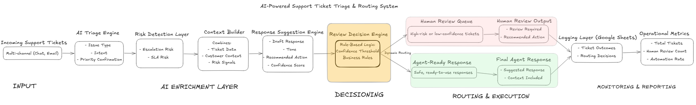
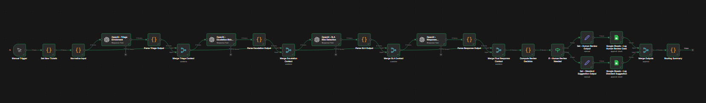
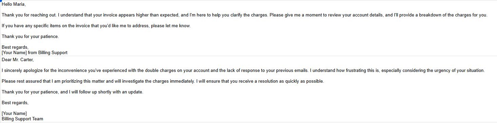
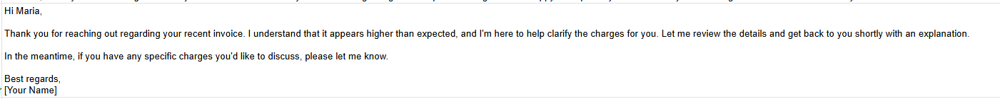
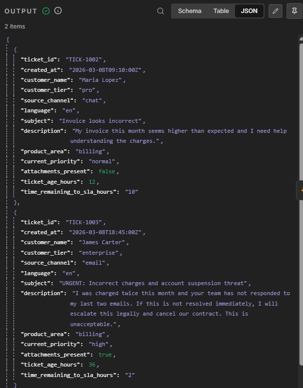
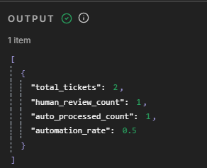

# AI Response Suggestion Automation

AI-powered response recommendation workflow built with **n8n** and **OpenAI** to assist support agents with real-time, context-aware reply suggestions.

---

## Overview

Support agents spend a significant amount of time crafting responses — often repeating similar answers, searching knowledge bases, or rephrasing existing solutions.

This project introduces an **AI Response Suggestion system** that analyzes incoming tickets and generates high-quality, context-aware reply drafts in real time.

Rather than replacing agents, this system enhances productivity by providing **assistive, human-in-the-loop AI recommendations** that improve speed, consistency, and quality.

This is **Project 5** in a broader system:

- Project 1 → AI Ticket Triage  
- Project 2 → Escalation Risk Detection  
- Project 3 → SLA Breach Prediction  
- Project 4 → Weekly Support Intelligence Report  
- Project 5 → AI Response Suggestion *(this project)*  

---

## Architecture

This workflow represents the **agent-assist layer** of a multi-stage AI-powered support operations pipeline, sitting directly in the resolution phase to accelerate response creation while maintaining human oversight.

---

## AI Support Automation Series

This project is part of a multi-stage AI-powered support operations system designed to move teams from reactive workflows to proactive, intelligence-driven operations.

Each project builds on the previous one:

### 🔹 Project 1: AI Ticket Triage  
Classifies incoming support tickets, enriches them with structured metadata, and establishes a clean foundation for downstream automation.  
👉 https://github.com/jesseautomates/ai-support-ticket-triage-automation

---

### 🔹 Project 2: Escalation Risk Detection  
Identifies tickets likely to escalate by analyzing urgency, sentiment, and response patterns, enabling earlier intervention.  
👉 https://github.com/jesseautomates/ai-support-escalation-risk-detection

---

### 🔹 Project 3: SLA Breach Prediction  
Predicts which tickets are at risk of missing SLA before deadlines are breached, allowing teams to prioritize and act proactively.  
👉 https://github.com/jesseautomates/ai-sla-breach-prediction

---

### 🔹 Project 4: Weekly Support Intelligence Report  
Aggregates support metrics and AI signals into a structured weekly report with insights, risks, and recommendations.
👉 https://github.com/jesseautomates/ai-support-intelligence-report/

---

### 🔹 Project 5: AI Response Suggestion *(this project)*  
Generates intelligent, context-aware response drafts to assist agents in resolving tickets faster and more consistently.

---

Together, these projects form a layered AI pipeline:

**Triage → Risk Detection → SLA Prediction → Intelligence Reporting → Agent Assistance**

This progression demonstrates how AI can be applied across the full support lifecycle.

---

## What this workflow does

- Ingests incoming support tickets in real time  
- Enriches ticket context using prior automation outputs  
- Generates AI-powered response suggestions  
- Applies tone, formatting, and quality guidelines  
- Returns structured response drafts for agent review  
- Supports faster, more consistent customer communication  

---

## How it works

### 1. Ticket Intake & Context Enrichment
- Receives incoming ticket data (API, webhook, or queue)
- Pulls in enriched metadata from earlier stages:
  - Category
  - Priority
  - SLA risk
  - Sentiment

---

### 2. Context Structuring
- Formats ticket data into a structured prompt input
- Includes:
  - Customer issue
  - Relevant context
  - Business rules (tone, policy, constraints)
- Prepares data for AI processing

---

### 3. AI Response Generation
- OpenAI generates a suggested response
- Ensures output:
  - Is clear and concise
  - Matches support tone and brand voice
  - Addresses the issue directly
  - Includes next steps or resolution

- Can generate multiple variations:
  - Formal vs friendly tone
  - Short vs detailed response

---

### 4. Response Validation & Guardrails
- Applies validation checks:
  - No hallucinated information
  - Adheres to policy constraints
  - Avoids sensitive or restricted content
- Adds fallback logic if output fails validation

---

### 5. Output Formatting
- Structures response into agent-ready format:
  - Clean text block
  - Optional bullet points
  - Suggested subject line
- Can include:
  - Confidence score
  - Suggested macros or tags

---

### 6. Delivery Layer (Human-in-the-Loop)
- Sends response suggestion to:
  - Support agent interface
  - Slack or internal tool
- Agent reviews, edits, and sends final response
- Maintains full human control over communication

---

## Example Output

### Sample Ticket

> “I’m trying to log into my account but keep getting an error saying my credentials are invalid.”

---

### AI Response Suggestion

Hi there,  

Thanks for reaching out — I’m happy to help with this.  

It looks like you may be encountering an issue with your login credentials. I recommend trying the following steps:

- Double-check your email and password for any typos  
- Reset your password using the “Forgot Password” link  
- Ensure caps lock is turned off  

If you’re still unable to log in after trying these steps, please let me know and I’ll take a closer look.  

Best,  
Support Team  

---

### Alternative (Short Version)

Hi there — it looks like a login credential issue.  

Please try resetting your password using the “Forgot Password” link. If that doesn’t work, I’m happy to investigate further.  

---

## Screenshots

### Workflow Overview

### Sample Response Output (No Human Review Required)

### Sample Response Output (Human Review Required)

### Sample Raw Ticket Data

### Recap Output for Input on Dashboards

---

## Tech Stack

- **n8n** (workflow orchestration)  
- **OpenAI API** (response generation)  
- Optional integrations:
  - Help desk platforms (Zendesk, ServiceNow, etc.)
  - Slack / internal tools  
  - Knowledge base systems  

---

## Setup

1. Import the workflow JSON into n8n  
2. Add API credentials (OpenAI, etc.)  
3. Configure your ticket intake source (webhook, API, etc.)  
4. Define prompt structure and tone guidelines  
5. (Optional) Connect knowledge base or historical ticket data  
6. Test response generation with sample tickets  
7. Tune prompts and validation logic  

---

## Key Takeaways

- Demonstrates **human-in-the-loop AI design** for support operations  
- Improves **agent efficiency and response consistency**  
- Reduces time spent drafting repetitive responses  
- Serves as a foundation for more advanced AI-assisted support systems  
